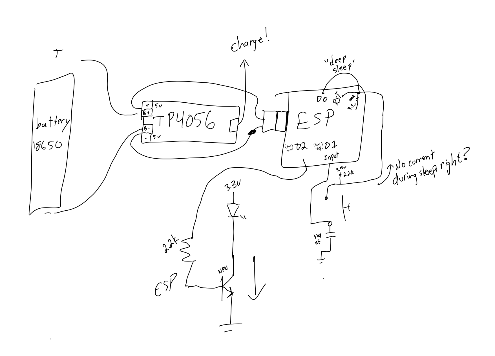
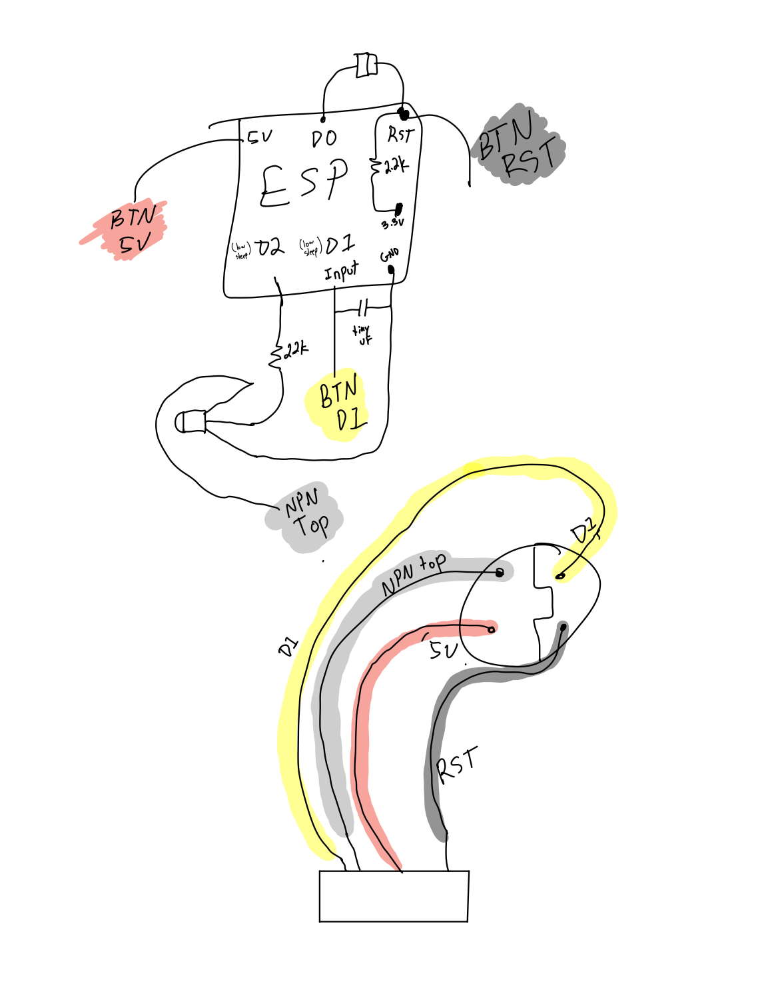
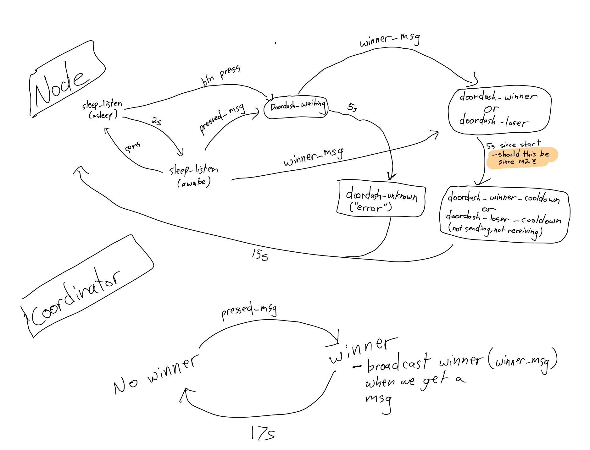

Houses with many people have a problem: when the doorbell rings, who's going to get it? If someone decides to get the door, how do they let someone else know that they're getting the door?

This project is a solution. It consists of a set of battery powered microcontrollers and led-integrated buttons. If a button is pressed, the LEDs on all the other buttons are lit up to indicate that someone has pressed the button. After, say, 20 seconds, the system resets and waits for a new button press.

This has a respectable battery life, because it largely sits in deep sleep. There's one coordinator that determines the winner (first message to get to the coordinator wins). This allows for meshing such that nodes can talk through each other to reach the coordinator.

A project by myself and [@MarcManiez](https://github.com/MarcManiez)

# Low Power Calculation
Here's a graph power capture where the ESP is in deep sleep for 2s, then wakes up to listen for ESP NOW messages. This happens repeatedly, so this 4.5mA average is the total average consumption when the buttons aren't pressed.

For our battery, that's 3200mAh / 4.5 / 24 hours ~= 29 days of battery life.

When the battery is pressed, the average consumption is 90mA for 20 seconds:

90mA * 20 seconds / 3600 seconds per hour = 0.5mAh consumed per button press. So if you press the button 20 times per day, that's only a 10% overhead beyond what the idle consumption is.

# Materials
- WeMos D1 Mini Pro V3.0 (Need one of these newer versions because they use [less current during sleep](https://salvatorelab.com/2023/01/wemos-d1-mini-deep-sleep-current-draw/))
- [TP4056 Li-ion charger breakout board](https://www.amazon.com/gp/product/B00LTQU2RK/ref=ppx_yo_dt_b_search_asin_title?ie=UTF8&psc=1)
- Some resistors and a capacitor
- [1x button + LED](https://www.amazon.com/gp/product/B0816R824L/ref=ppx_yo_dt_b_search_asin_title?ie=UTF8&psc=1)
- 18650 battery and holder (We used an [EVE INR18650-33V](https://www.18650batterystore.com/products/eve-18650-33v))
- A micro-usb cable that will get cut ([like this](https://www.amazon.com/gp/product/B0BZ8XWL18/ref=ppx_yo_dt_b_search_asin_title?ie=UTF8&psc=1))
- [Project Box](https://www.amazon.com/gp/product/B0859Z8PRP/ref=ppx_yo_dt_b_search_asin_title?ie=UTF8&psc=1)
- [Hole Saw](https://www.amazon.com/gp/product/B073M2Y1B3/ref=ppx_yo_dt_b_search_asin_title?ie=UTF8&psc=1)

# Schematic

It's worth noting the purpose the capacitor on D1. The ESP8266 does not give you a way to determine if the device woke up due to a button press or the timer. The capacitor solves this by charging up when the button is pressed. When a user presses the button, the RST pin goes low immediately, and quickly goes back to high when the capacitor charges. This low -> high transition causes the ESP to wake up. When it does, the first thing we do is read D1. If it's high, that means the button was pressed.

If the button was pressed, we *keep the capacitor charged* so that pressing the button is disabled (it won't bring RST low). Then, before going to sleep, we programatically discharge the capacitor by making D1 an output and setting it to LOW for a few ms. Genius :).

# Wiring Diagram

# State Machine

# Programming steps

- Install platformio
- Connect one of the microcontrollers via USB
- Run `platformio run -t upload`

# TODO and future feature ideas
- Reduce power consumption. I think going into light sleep could be better, see the end of https://www.espressif.com/sites/default/files/9b-esp8266-low_power_solutions_en_0.pdf. This seems to require the RTOS SDK, though.
- Synchronize the buttons better such that they all turn off at the same time
- Audio?
- Have a sensor (microphone?) that notices when the doorbell is actually pressed
- Don't require a coordinator. Let the devices figure out a winner amongst themselves.
- It seems the ESP8266 can sink 20mA of current, so we can directly power the LED without a transistor.
